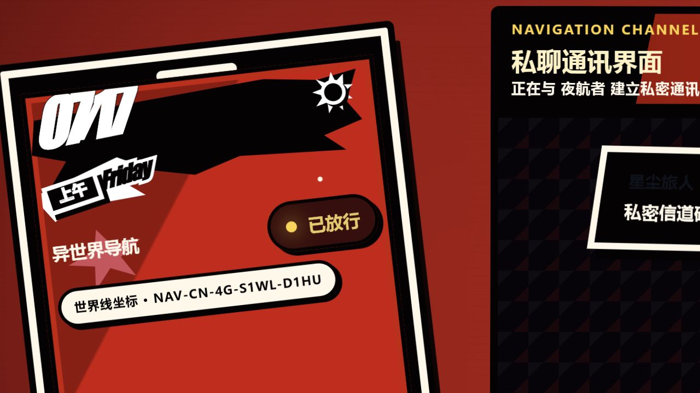
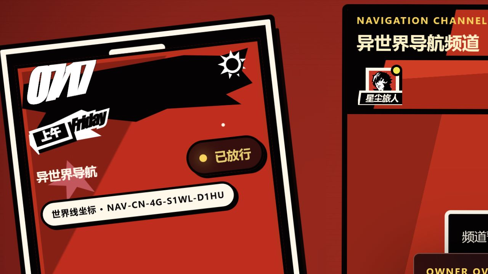

# 暗号频道 · Isekai Navigation Channel

> 一个把“加入群聊”做成异世界通行仪式的实时聊天室。

[](https://www.python.org/)
[](https://fastapi.tiangolo.com/)
[](https://www.sqlite.org/)
[](#技术实现)

“暗号频道”不是一个打开链接就能说话的普通聊天室。访客要先选择一张频道头像、填写代号并递交通行申请；只有管理员放行后，手机里的导航状态才会从“未连接”切换为“已放行”，真正进入这条世界线。

项目以《女神异闻录 5》式的怪盗视觉语言为灵感：黑、红、黄的高对比配色，倾斜卡片、粗重描边、漫画切片、手机界面与不完全对齐的排版共同构成一种“手工剪贴但又非常利落”的舞台感。它不是官方项目，而是一次对原作 UI 气质的个人化致敬——没有直接照搬一张菜单，而是把审核、聊天、私聊和后台管理都重新翻译成了“异世界导航”的叙事。


## 这不是登录，是一次通行仪式

第一次进入网站时，访客看不到频道历史，也不能绕过申请页。代号最长 18 个字符，头像从服务器统一维护的库中选择，提交后进入 `pending` 状态，等待管理员决定这位“旅人”能否加入。

完整身份状态包括：

- `pending`：申请已递交，等待审核
- `approved`：已放行，可进入公屏和私聊
- `rejected`：申请被拒绝
- `banned`：设备已被封禁

身份不依赖传统账号密码，而是绑定浏览器本地保存的设备码。刷新页面或服务重启后，老用户仍能找回自己的身份与审核状态。

## 频道里能做什么


### 公屏与实时通讯

- 公共频道消息通过 SSE 实时推送
- 无法稳定保持事件流的公网隧道会自动回退到轮询同步
- 消息、用户和管理状态长期保存在 SQLite 中
- 单条消息最长 420 个字符，支持 `Enter` 发送、`Shift + Enter` 换行
- 黄、红两种“信号色”不是普通主题开关，而是消息本身的情绪标记

### 一对一私聊

批准用户可以从在线成员、历史消息头像、消息旁的“私聊”按钮或私聊列表发起一对一通讯。切换私聊后，标题、提示语、输入框和发送按钮会一起进入“私密通讯界面”，而不是只在原页面角落弹出一个普通对话框。



公聊与私聊都会实时更新，也都会长期保存。管理员撤回时采用软撤回：数据库保留原始记录，普通用户只会看到“已撤回”。

### 独立头像系统


头像不只是注册时的一次性选项：

- 项目自带一组经过统一处理的怪盗风频道头像
- `/avatars.html` 提供独立的头像选择页
- 已有代号的用户保存头像时会同步服务器身份
- 管理员可以上传、改名、排序、启用或停用头像
- 上传内容会检查真实文件头，只接受 PNG、JPG/JPEG、WebP，单文件不超过 2 MB
- 历史消息保存头像快照；即使某张头像后来停用，旧消息仍然能正常显示
- 系统始终保证至少有一张可用头像，避免把入口配置成“无头像可选”的死局

## 管理面板也是世界观的一部分

管理控制台没有被拆成一个毫无关系的通用后台模板，而是以 `OWNER OVERLAY` 的形式直接覆盖在聊天室舞台上。普通访客不会加载或看到入口，只有访问 `/?admin=1` 才会启用管理界面。



管理员可以在同一页面完成：

- 审核、拒绝和查看申请
- 查看全部用户及在线状态
- 设置或取消保护号
- 按设备码封禁用户，并默认附带 HMAC 处理后的 IP 指纹
- 解封用户并清除对应封禁记录
- 查看并撤回公聊、私聊消息
- 清屏当前公共频道
- 上传、改名、排序、启用和停用头像

管理员登录成功时，当前设备可以成为保护号。保护号不能被封禁；即使发生误操作，也不会把唯一的管理身份永远锁在世界线之外。

## 还原气质的小巧思

这部分是项目最有趣的地方：功能不是先做完再套一层红黑皮肤，而是从交互含义上就参与了世界观。

| 设计 | 小巧思 |
| --- | --- |
| 手机作为信息中枢 | 左侧不是装饰插画：它会同步最近对话、连接状态、当前日期与时段。 |
| 动态日期与时段 | 上午、下午、傍晚、夜晚会改变手机上的时段文字与图形状态，让页面像一块正在运行的游戏 HUD。 |
| 世界线坐标 | `NAV-CN-4G-S…-D…` 由地区时区、网络类型、当前服务地址和设备码生成；看起来像导航编号，但不包含精确位置。 |
| 放行状态 | `pending / approved / rejected / banned` 被翻译成“申请、放行、拒绝、封禁”的通行叙事。 |
| 漫画式消息 | 内置头像在消息区优先使用透明切片，让人物像从对话框边缘探出来，而不是规整地塞进圆形头像框。 |
| 不规则构图 | 旋转、错位、粗描边和硬阴影刻意保留“剪贴漫画”的不稳定感，同时表单与按钮仍保持清晰可用。 |
| 黄 / 红信号 | 两种消息色被写进聊天数据，既是视觉变化，也是发送者当下情绪的频道信号。 |
| 私聊变换舞台 | 进入私聊会改变整个频道标题、消息范围和输入区文案，像切换到另一条加密线路。 |
| 管理覆盖层 | 后台仍属于同一舞台；管理员不是离开世界观去操作表格，而是打开专属 OWNER OVERLAY。 |
| 软撤回与清屏 | “撤回”留下数据库记录，“清屏”只移动可见起点；视觉效果和数据安全各自成立。 |

## 技术实现

| 层级 | 实现 |
| --- | --- |
| 后端 | Python、FastAPI、Uvicorn |
| 数据库 | SQLite，可重复执行的兼容迁移 |
| 实时通信 | Server-Sent Events（SSE）+ 轮询回退 |
| 前端 | 原生 HTML、CSS、JavaScript，无构建步骤 |
| 部署 | Windows 批处理、Docker Compose |

项目刻意保持轻量：没有前端框架、打包器和额外运行时。FastAPI 同时提供 API、事件流和静态文件服务，SQLite 负责持久化，适合本机联机、小型云服务器或教室里的临时频道。

## 快速开始

### Windows

安装依赖：

```powershell
python -m pip install -r requirements.txt
```

本机预览直接运行：

```text
启动聊天网站.bat
```

然后访问：

```text
http://127.0.0.1:8787/
```

> 请始终通过服务地址打开网站，不要直接双击 `public/index.html`。

### 手动启动

```powershell
$env:ADMIN_PASSWORD="换成强管理员口令"
$env:APP_SECRET="换成足够长的随机字符串"
python server.py
```

仅限本机开发预览时，也可以使用：

```powershell
$env:ALLOW_DEV_DEFAULTS="1"
python server.py
```

常用入口：

| 页面 | 地址 |
| --- | --- |
| 聊天室 | `http://127.0.0.1:8787/` |
| 头像选择 | `http://127.0.0.1:8787/avatars.html` |
| 管理员入口 | `http://127.0.0.1:8787/?admin=1` |

## Docker 部署

Linux / macOS：

```bash
export ADMIN_PASSWORD="换成强管理员口令"
export APP_SECRET="换成足够长的随机字符串"
docker compose up -d --build
```

PowerShell：

```powershell
$env:ADMIN_PASSWORD="换成强管理员口令"
$env:APP_SECRET="换成足够长的随机字符串"
docker compose up -d --build
```

默认对外端口是 `8787`。通过 `PORT` 可以修改宿主机端口，容器内部仍监听 `8787`，运行数据保存在 `/data` 数据卷。

## 公网分享

Windows 辅助脚本会优先尝试 Cloudflare Tunnel，不可用时回退到 SSH / Serveo：

```text
安装公网穿透工具.bat
启动公网穿透.bat
```

正式公网部署建议使用稳定域名、HTTPS 入口和反向代理，并显式配置强随机的管理员口令与应用密钥。

## 数据保留与安全

默认运行数据位于：

```text
data/chat.sqlite3
data/avatars/
data/backups/
```

- 聊天记录不会因为刷新或重启消失
- 历史接口最多返回最近 300 条，避免无限加载拖慢页面
- 管理员令牌有有效期，登录失败有次数限制
- 不保存明文 IP，只保存由应用密钥参与计算的指纹
- 默认启用 CSP、禁止 iframe、MIME 嗅探保护、引用来源策略和权限策略
- 生产环境必须设置 `ADMIN_PASSWORD` 和足够长、随机的 `APP_SECRET`
- 生产环境不要使用 `ALLOW_DEV_DEFAULTS=1`

## 项目结构

```text
.
├─ server.py                 # API、认证、SQLite、SSE 与静态文件服务
├─ public/
│  ├─ index.html             # 申请入口与聊天主舞台
│  ├─ app.js                 # 身份、聊天、公私聊与实时同步
│  ├─ admin-panel.js         # 内置 OWNER OVERLAY
│  ├─ avatars.html           # 独立头像选择页
│  ├─ avatars.js
│  └─ assets/                # 背景、插画、头像与透明切片
├─ docs/screenshots/         # README 站内实机截图
├─ Dockerfile
└─ docker-compose.yml
```

## 基础检查

```powershell
python -m py_compile server.py
docker compose config
```

---

如果把普通聊天室理解为一个房间，那么“暗号频道”更像一条需要被批准才能接入的世界线：身份、权限、消息和管理操作都存在，但它们始终使用同一种视觉语言说话。
