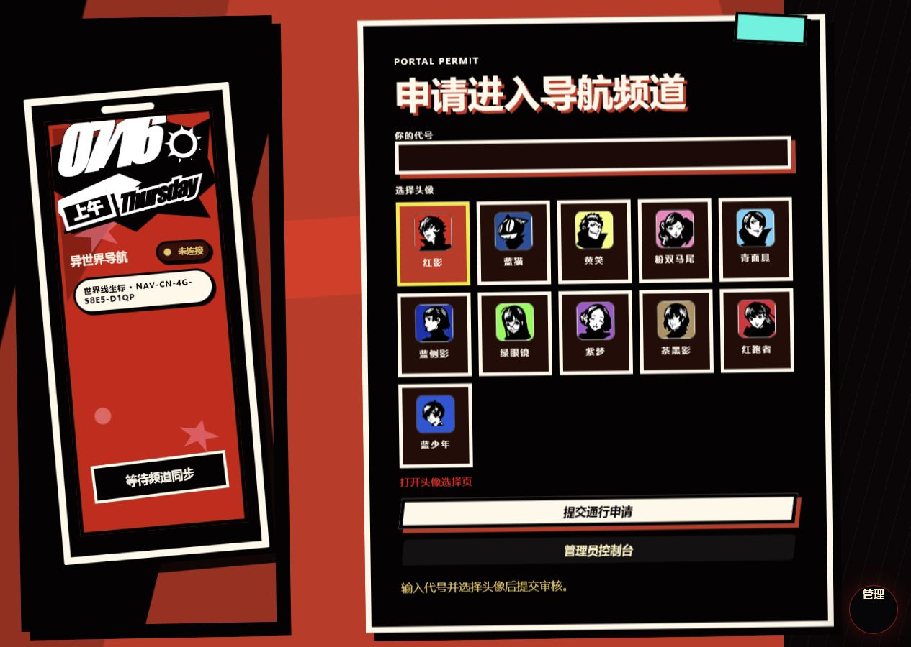
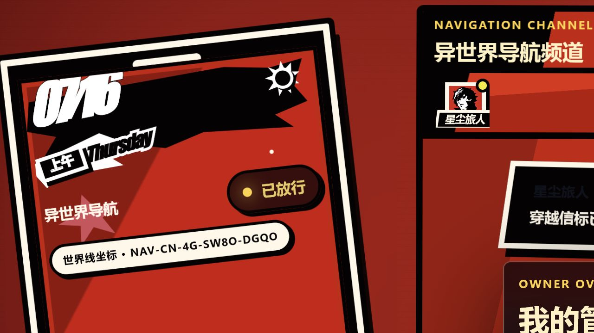
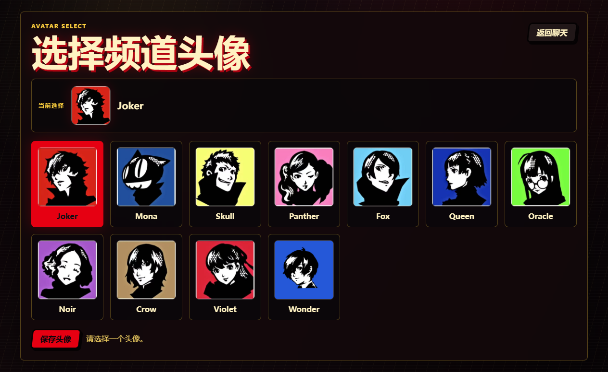

# 暗号频道

一个可自行部署的p5风格、异世界导航主题实时聊天室。

访客不能直接进入频道：需要先填写代号、选择头像并提交申请，等待管理员审核通过后才能参与公聊或一对一私聊。项目采用 FastAPI、SQLite 与原生前端实现，无需前端构建步骤，适合在 Windows、本地服务器或 Docker 环境中快速运行。

## 功能预览

### 访客申请与头像准入

访客首次打开网站时只能看到通行申请界面，提交代号和头像后进入审核状态。



### 实时频道与内置管理控制台

审核通过后即可进入公共频道；管理员控制台直接内置在聊天页面，可处理用户、消息、私聊和头像库。



### 独立头像选择页

用户可以从头像库中选择频道身份。管理员上传的头像与项目自带头像会统一展示。



## 核心能力

- 访客申请、管理员审核、拒绝与设备级封禁
- `pending`、`approved`、`rejected`、`banned` 完整身份状态
- 公共频道与一对一私聊
- SSE 实时事件推送，并提供轮询回退
- SQLite 长期保存消息、用户和管理状态
- 公聊与私聊消息软撤回，保留数据库原始记录
- 管理员清屏只调整可见起点，不物理删除历史
- 在线成员列表，可从成员、消息头像或私聊列表发起私聊
- 头像上传、改名、排序、启用和停用
- 桌面与手机窄屏适配
- CSP、安全响应头、管理员登录限流和限时管理令牌

## 技术栈

| 层级 | 实现 |
| --- | --- |
| 后端 | Python、FastAPI、Uvicorn |
| 数据库 | SQLite |
| 实时通信 | Server-Sent Events（SSE）+ 轮询回退 |
| 前端 | 原生 HTML、CSS、JavaScript |
| 部署 | Windows 批处理、Docker Compose |

## 快速开始

### Windows 一键启动

首次使用先安装依赖：

```powershell
python -m pip install -r requirements.txt
```

本地预览可运行：

```text
启动聊天网站.bat
```

随后通过浏览器访问：

```text
http://127.0.0.1:8787/
```

> 本地启动脚本允许开发默认配置，仅适合本机预览。公网环境必须显式设置管理员口令和应用密钥。

### PowerShell 手动启动

```powershell
$env:ADMIN_PASSWORD="换成强管理员口令"
$env:APP_SECRET="换成足够长的随机字符串"
$env:DATABASE_PATH="data/chat.sqlite3"
python server.py
```

常用入口：

| 页面 | 地址 |
| --- | --- |
| 聊天室 | `http://127.0.0.1:8787/` |
| 头像选择 | `http://127.0.0.1:8787/avatars.html` |
| 管理员入口 | `http://127.0.0.1:8787/?admin=1` |

管理员入口默认对普通访客隐藏，只有地址携带 `?admin=1` 时才会加载控制台。旧的 `/admin.html` 仅负责跳转到该入口。

## Docker 部署

Linux/macOS：

```bash
export ADMIN_PASSWORD="换成强管理员口令"
export APP_SECRET="换成足够长的随机字符串"
docker compose up -d --build
```

PowerShell：

```powershell
$env:ADMIN_PASSWORD="换成强管理员口令"
$env:APP_SECRET="换成足够长的随机字符串"
docker compose up -d --build
```

默认对外端口为 `8787`。如需调整：

```bash
PORT=8080 docker compose up -d --build
```

容器内部仍监听 `8787`，数据库及头像数据保存在 `/data` 数据卷中。

## 头像系统

- 项目自带的 11 张频道头像位于 `public/assets/avatars/`
- 服务启动时会将内置头像同步到数据目录
- 管理员上传的头像与内置头像共同组成头像库
- 支持 PNG、JPG/JPEG、WebP，单文件最大 2 MB
- 服务会验证真实图片内容，不只依赖扩展名或 MIME 声明
- 停用头像不会破坏已有用户或历史消息中的头像显示

## 数据与消息保留

本地默认数据位置：

```text
data/chat.sqlite3
data/avatars/
data/backups/
```

这些目录属于运行时用户数据，不应提交到 Git 仓库。

- 消息刷新页面或重启服务后仍然保留
- 管理员撤回采用软撤回，用户端显示“已撤回”
- 清屏不会物理删除历史消息
- 历史接口最多返回最近 300 条记录
- 封禁以设备码为基础，并默认附带经过 HMAC 处理的 IP 指纹，不保存明文 IP

## 生产安全

公网部署前必须：

1. 设置强随机 `ADMIN_PASSWORD`
2. 设置足够长且随机的 `APP_SECRET`
3. 禁止使用 `ALLOW_DEV_DEFAULTS=1`
4. 通过反向代理或云平台入口提供 HTTPS
5. 持久化并定期备份 `/data` 数据卷

项目默认保留 CSP、禁止 iframe、MIME 嗅探保护、引用来源策略和权限策略等安全响应头。

## 公网分享

Windows 环境可使用仓库中的辅助脚本：

```text
安装公网穿透工具.bat
启动公网穿透.bat
```

脚本优先使用 Cloudflare Tunnel；不可用时会尝试 SSH/Serveo 回退。正式部署建议使用自有域名、HTTPS 和稳定的反向代理。

## 项目结构

```text
.
├─ server.py                 # FastAPI、认证、SQLite、事件推送
├─ public/
│  ├─ index.html             # 聊天主页面
│  ├─ app.js                 # 访客、聊天和实时同步逻辑
│  ├─ admin-panel.js         # 内置管理员控制台
│  ├─ avatars.html           # 头像选择页
│  ├─ avatars.js
│  └─ assets/                # 背景、插画和内置头像
├─ data/                     # 运行时数据，不提交
├─ Dockerfile
└─ docker-compose.yml
```

## 基础检查

```powershell
python -m py_compile server.py
docker compose config
```

请始终通过服务地址访问网站，不要直接双击 `public/index.html`。
